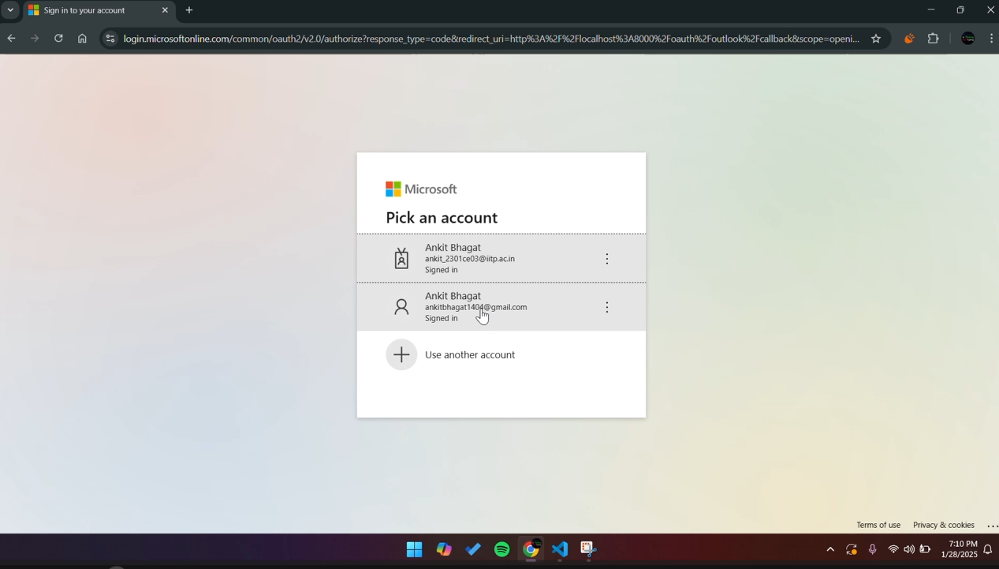
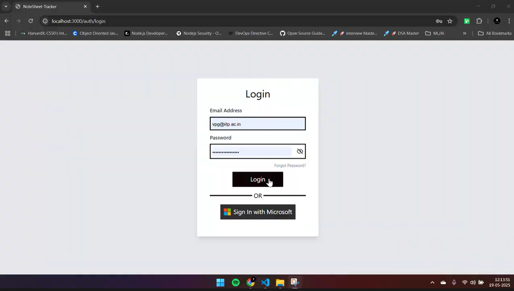
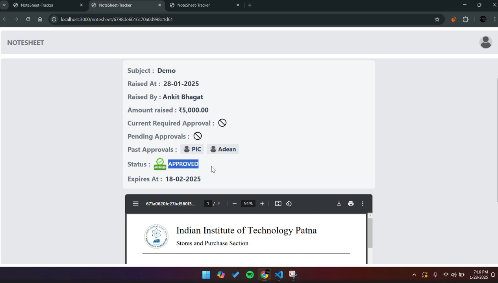

# Notesheet Tracker

This project manages and tracks payment bills passed by the PIC (Payment In Charge) for various clubs. It supports three types of notesheet templates:

1. **Reimbursement**: Used to request compensation for personal expenses incurred during an event. For example, if a club member spent their own money on an event, they can request reimbursement for the amount spent.  
2. **Disbursement**: Used to request advance money for an upcoming event. This helps in getting funds before the event takes place.  
3. **Settlement**: Used for settling all bills and expenses related to an event after it has concluded. This template helps in ensuring that all payments and dues are cleared.

Once a notesheet is created, it goes through a series of approvals from different authorities in a predefined sequence. For example, a reimbursement notesheet will first be submitted to the General Secretary (GenSec), followed by the Vice President Gymkhana (VPG), then to the President Gymkhana, followed by the Payment In Charge (PIC), and finally the Assistant Dean (ADean). The notesheet is approved only after all necessary approvals are granted.

---

# ⚙️ Tech Stack

The Notesheet Tracker leverages a modern web stack optimized for performance, security, and scalability:

### 💻 Frontend
- **Framework**: Next.js
- **Styling**: Tailwind CSS
- **Authentication**: Microsoft OAuth 2.0 (PKCE flow)

### 🌐 Backend
- **Runtime**: Node.js
- **Framework**: Express.js
- **Database**: MongoDB with Mongoose ORM

### 📦 DevOps & Deployment
- **Dockerized**: Client and Server in separate containers
- **Hosting**: Deployed using Render

### 🌍 Hosted Links
- 🔗 [Client](https://notesheet-tracker-client.onrender.com/)
- 🔗 [Server](https://notesheet-tracker-server.onrender.com/)

---

# Demo

## 1. User POV

[](https://drive.google.com/file/d/1p52F0r_hUTuvVX1-pJOJEB6xhnk7lY3-/view?usp=sharing)  
> **Login**: [Continue with Microsoft](https://notesheet-tracker-client.onrender.com/auth/login)

---

## 2. VPG POV

[](https://drive.google.com/file/d/16QPLHUgeUNqENf8s2ay8Xw9HpFoKCrf1/view?usp=sharing)  
> Email: `vpg@iitp.ac.in`  
> Password: `qwertTyuio@p12345`  
> [Go to login page](https://notesheet-tracker-client.onrender.com/auth/login)

---

## 3. ADean POV

[](https://drive.google.com/file/d/1UUWDITBjATgV7fRQEnzsofwRkAEnMZrJ/view?usp=sharing)  
> Email: `adean@iitp.ac.in`  
> Password: `qwertTyuio@p12345`  
> [Go to login page](https://notesheet-tracker-client.onrender.com/auth/login)

---

# Prerequisites

- Docker version 27.0.3 or above  
- Docker Compose version v2.28.1 or above

You can verify your versions by running:

```bash
docker -v
docker-compose -v
```

---

# Development Setup with Docker

This project uses Docker Compose for easy containerized development of both client and server.

To start the development environment, run this command at the root directory of the project:

```bash
docker compose up --build
```

This command will:

- Build the Docker images for both client and server based on their Dockerfiles.  
- Start containers for client (on port 3000) and server (on port 8000).  
- Sync your local code changes into the containers automatically, enabling live development.

---

# Continuous Development Setup with Docker Compose

The `docker-compose.yml` uses `develop.watch` to watch for changes in the codebase and automatically rebuild the containers. This allows you to see your changes reflected in real-time without needing to restart the containers manually.

To run the development environment with hot reloading, use the following command:

```bash
docker compose watch
```

---

# Accessing the Application

- Client UI: [http://localhost:3000](http://localhost:3000)  
- API Server: [http://localhost:8000](http://localhost:8000)

---

# Stopping the Development Environment

To stop and remove the containers, press `Ctrl + C` in the terminal running Docker Compose, then run:

```bash
docker compose down
```

---

# ⚠️ Note on Render Cold Start

Render spins down services after periods of inactivity. The first load may take **50 seconds or more**.

To warm up the services, send a simple GET request to:

- [https://notesheet-tracker-client.onrender.com](https://notesheet-tracker-client.onrender.com)
- [https://notesheet-tracker-server.onrender.com](https://notesheet-tracker-server.onrender.com)
